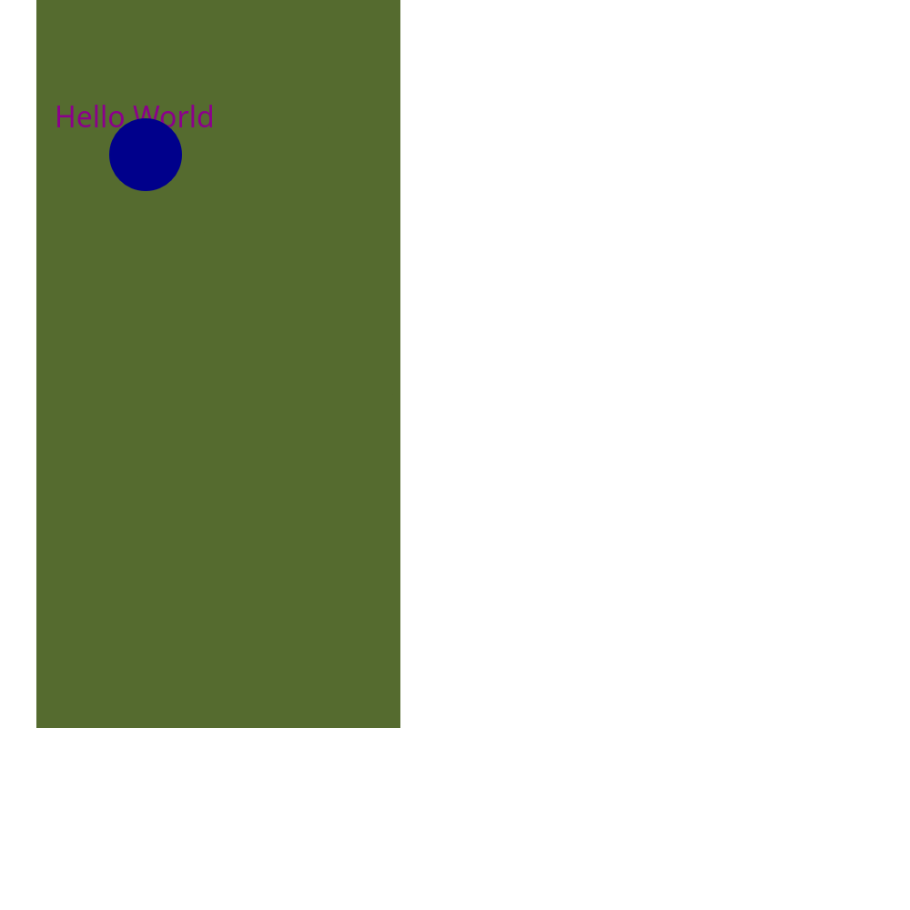

# easy-svg

easy-svg is a crate for composing SVGs with rust code through a statically-typed system. The motivation behind this project is that [other rust svg libraries](https://crates.io/crates/svg) require you to set attributes by string, leading to invalid states and a worse dev experience. easy-svg is being implemented per the [Mozilla MDN SVG Reference](https://developer.mozilla.org/en-US/docs/Web/SVG/Reference), allowing for no ambiguity in SVG composition. 

```rust
Svg::new(500., 500.)
            .add_element(
                Rect::new()
                    .width(200.)
                    .height(400.)
                    .x(20.)
                    .fill(Color::DarkOliveGreen),
            )
            .add_element(
                Text::new()
                    .x(30.)
                    .y(70.)
                    .fill(Color::DarkMagenta)
                    .add_child_string("Hello World".to_string())
                    .font_family("Arial".to_string()),
            )
            .add_element(
            	Circle::new()
            		.fill(Color::DarkBlue)
            		.r(20.)
            		.cx(80.)
            		.cy(85.)
            )
```




This project is a work in progress, and there may be minor breaking changes in the future. This crate is not yet feature-complete, however adding any individual tag or attribute is trivial so you can [open an issue](https://github.com/effdotsh/easy-svg/issues/new) or file a pr updating `svg_elements.yml`.

